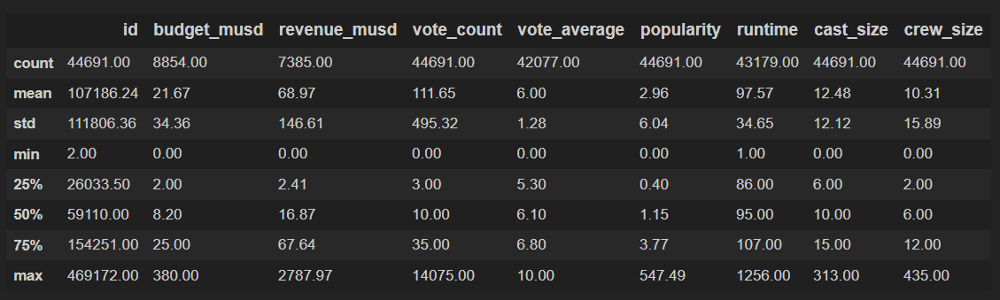

<!-- ABOUT THE PROJECT -->
## About

Analysing and presention of a 40k movie dataset. 

<!-- DATASET -->
## The Dataset

* id: The ID of the movie (clear/unique identifier).
* title: The Official Title of the movie.
* tagline: The tagline of the movie.
* release_date: Theatrical Release Date of the movie.
* genres: Genres associated with the movie.
* belongs_to_collection: Gives information on the movie series/franchise the particular film belongs to.
* original_language: The language in which the movie was originally shot in.
* budget_musd: The budget of the movie in million dollars.
* revenue_musd: The total revenue of the movie in million dollars.
* production_companies: Production companies involved with the making of the movie.
* production_countries: Countries where the movie was shot/produced in.
* vote_count: The number of votes by users, as counted by TMDB.
* vote_average: The average rating of the movie.
* popularity: The Popularity Score assigned by TMDB.
* runtime: The runtime of the movie in minutes.
* overview: A brief blurb of the movie.
* spoken_languages: Spoken languages in the film.
* poster_path: The URL of the poster image.
* cast: (Main) Actors appearing in the movie.
* cast_size: number of Actors appearing in the movie.
* director: Director of the movie.
* crew_size: Size of the film crew (incl. director, excl. actors).

(<a href="#top">back to top</a>)

<!-- WALKTHROUGH -->
## Walkthrough

If you wish to go through the code and run each segment one by one, please, head over to Jupyter Notebook and open the project.

Stage 1:

Database is displayed and ordered by release date. Features of the database are revealed. Numerical data present in the database is displayed, such as: the movie budget, revenue, votes, popularity... 

These values are presented using a histogram. This helps visualise the outliars in certain features, for instance, highest budget for a movie is 380.0 million USD whereas the mean is 21.67. There are few movies with a cast size greater than 300. It seems like the voting for all of these movies average out at 6 rating and the distribution on both ends seems distinct with the lower end appearing to be less steep compared to the upper end. Finally, by using the `df.describe(include="object")` method, we can see the amount of duplicates/missing values from the dataset. Therefore, this dataset still needs to be cleaned. It seems `Cinderella` tittle occurs 11 times, therefore potential duplicates. We can see each of these cases using `df[df.title == "Cinderellla]` to look through if these are duplicates or not.

<!-- TECH -->
## Technologies

IDE: [Jupyter Notebook](https://jupyter.org/) (Language: python3)

Packages: [Numpy](https://numpy.org/), [Pandas](https://pandas.pydata.org/), [Matplotlib](https://matplotlib.org/) 

(<a href="#top">back to top</a>)

<!-- CONTRIBUTING -->
## Contributing

If you would like to add any extra features to the optimisation simulation, feel free to fork and create a pull request. Thank you!

1. Fork the Project
2. Create your Feature Branch (`git checkout -b feature/AmazingFeature`)
3. Commit your Changes (`git commit -m 'Add some AmazingFeature'`)
4. Push to the Branch (`git push origin feature/AmazingFeature`)
5. Open a Pull Request

(<a href="#top">back to top</a>)

<!-- CONTACT -->
## Contact

Erol Gelbul - [Website](http://www.erolgelbul.com) - erolgelbul@gmail.com

Project Link: [Movies' Data](https://github.com/ErolGelbul/movies_data)

(<a href="#top">back to top</a>)

