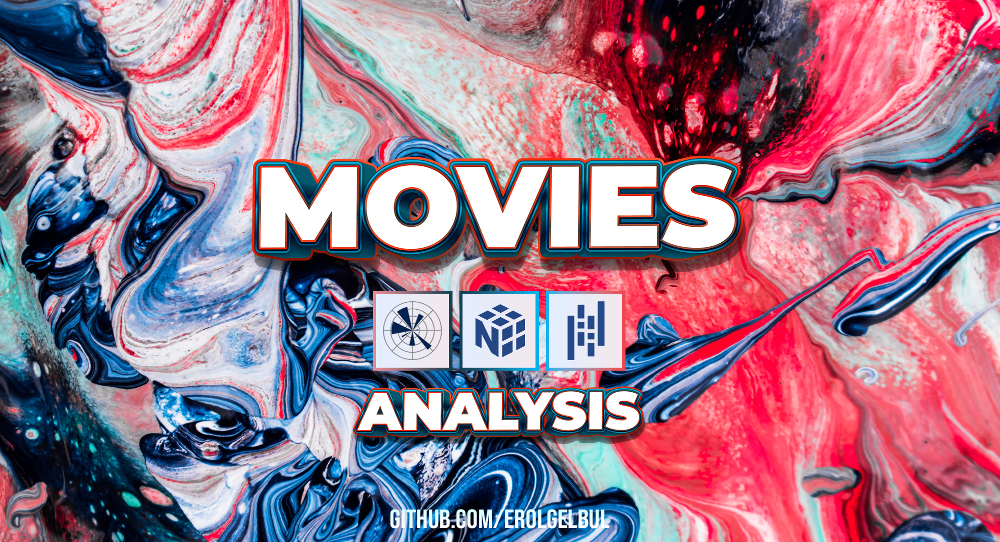
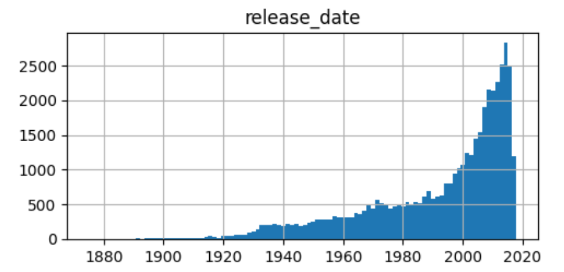
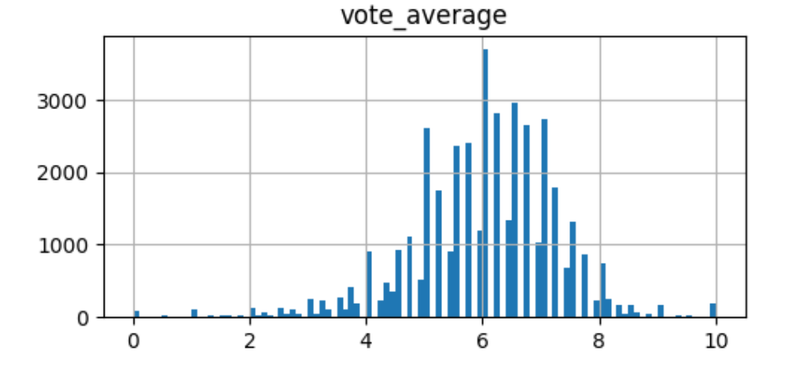
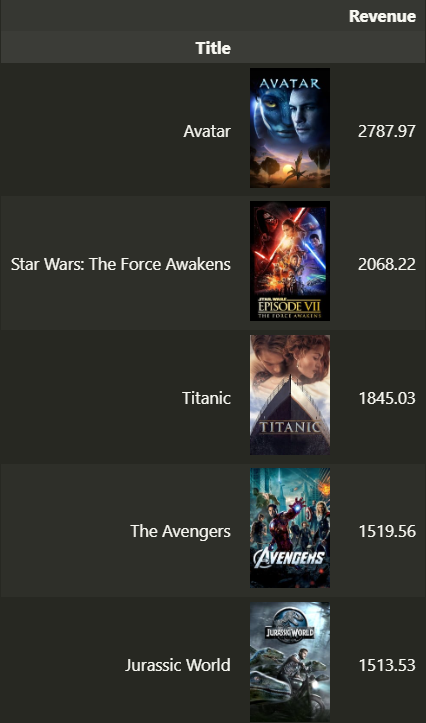
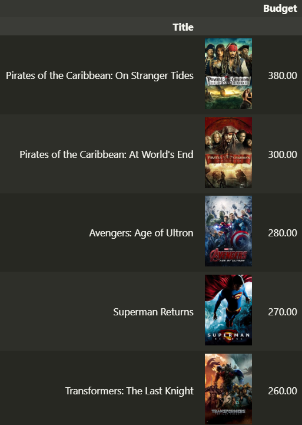
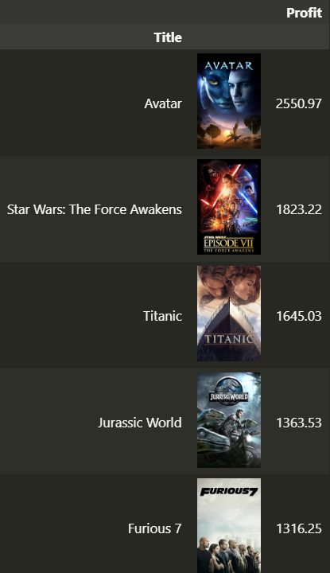
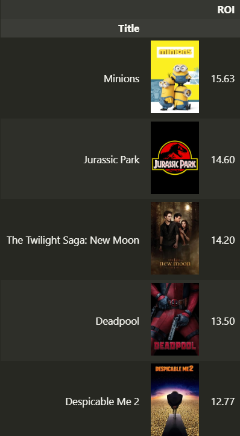

<!-- ABOUT THE PROJECT -->
## 1. About

Analysing and presenting a 40k movie dataset. 

<!-- ABOUT THE PROJECT -->
### 1.1 The Dataset

* id: The ID of the movie (clear/unique identifier).
* title: The Official Title of the movie.
* tagline: The tagline of the movie.
* release_date: Theatrical Release Date of the movie.
* genres: Genres associated with the movie.
* belongs_to_collection: Gives information on the movie series/franchise the particular film belongs to.
* original_language: The language in which the movie was originally shot in.
* budget_musd: The budget of the movie in million dollars.
* revenue_musd: The total revenue of the movie in million dollars.
* production_companies: Production companies involved with the making of the movie.
* production_countries: Countries where the movie was shot/produced in.
* vote_count: The number of votes by users, as counted by TMDB.
* vote_average: The average rating of the movie.
* popularity: The Popularity Score assigned by TMDB.
* runtime: The runtime of the movie in minutes.
* overview: A brief blurb of the movie.
* spoken_languages: Spoken languages in the film.
* poster_path: The URL of the poster image.
* cast: (Main) Actors appearing in the movie.
* cast_size: number of Actors appearing in the movie.
* director: Director of the movie.
* crew_size: Size of the film crew (incl. director, excl. actors).

<!-- TECH -->
### 1.2 Libraries

- [Pandas](https://pandas.pydata.org/)
- [Numpy](https://numpy.org/)
- [Matplotlib](https://matplotlib.org/)

(<a href="#top">back to top</a>)

## 2. Findings

### 2.1 Release Date

  

### 2.2 Vote Average

  

### 2.3 Highest Revenue

  

### 2.4 Highest Budget

  

### 2.5 Highest Profit

  

### 2.6 Least Profit

  

### 2.7 Highest Return on Investment

  

<!-- CONTACT -->
## 3. Contact

Erol Gelbul - [Website](http://www.erolgelbul.com)

Project Link: [Movies' Data](https://github.com/ErolGelbul/movies_data)

(<a href="#top">back to top</a>)

